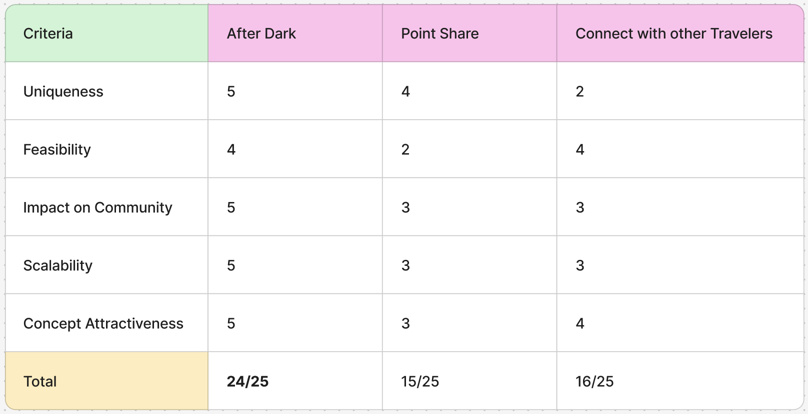

During the public holiday and mid-semester break, progress on this project was staggered and no clear direction had been finalised. In class, we made it our priority to settle on a concept, and by the end of a lengthy discussion we had committed to an idea, ‘After Dark’.

Drawing on my findings from Week 6, I proposed five ideas that targeted certain niches or had clear user-oriented outcomes. However, while niche, most did not feel unique enough to attract or sustain users and were therefore rejected. After narrowing the options down to three key concepts, we used a decision matrix to evaluate which direction to pursue. The criteria included uniqueness, feasibility, community impact, scalability, and overall concept attractiveness, each rated on a 5-point scale. At this stage, we were already leaning towards the “After Dark” concept, but the decision matrix was used to validate and justify this choice.

What makes me believe in the potential of ‘After Dark’ is that it addresses a genuine inconvenience embedded within Australian commercial culture: the difficulty of completing essential tasks after standard working hours have ended. In Australia, the majority of retail stores, services, and businesses close relatively early, which often leaves full-time workers limited opportunities to run errands or access services without adjusting their schedule. Our community hub responds to this gap by creating a centralised platform that helps users discover and connect with businesses, services, spaces, and opportunities available late at night. Rather than forcing people to reorganise their schedules around restrictive operating hours, the community hub supports greater flexibility and convenience, allowing individuals to complete tasks at their own leisure.

Another key strength of the platform is its ability to connect users with essential professionals during urgent situations. For example, if someone experiences a plumbing emergency, or other unexpected issues at night, After Dark can swiftly assist the user in locating available and trusted services nearby. This adds practical value to the platform by not only improving convenience, but also providing users with a greater sense of security, community and reliability when emergencies occur. 

Beyond its practical use cases, the platform also supports recreational activities. Users may use the hub to discover social opportunities, such as substituting sports teams, attending events, or connecting with others who are active during similar hours. This expands the hub beyond purely functional needs and allows it to also facilitate spontaneous, community driven interactions after standard hours.

## How does 'After Dark' address the criteria we have created during the early ideation phase?

**Target Audience:** Individuals in Australia who would benefit from being able to access services outside of standard business hours, particularly full-time workers, shift workers, and students. It also extends to people who experience unexpected late-night issues and require quick access to available services.

**Groups:** Transport, food, retail, house maintenance and plumbing, 24/7hr businesses, late night venues, entertainment, sports

**Niche Problem:** In Australia, many businesses close early which makes it inconvenient to get things done outside working hours.

**Ongoing Value:** The platform contains centralised information about after-hours services, businesses and freelancers which enables users to discover services whenever they are needed, particularly in critical or unpredictable situations. 

**Types of Information Shared:** Business operating hours, availability status, location, community posts, list of services, ongoing and upcoming events, emergency services

**Can advertising space be sold?:** Yes. Businesses can pay to promote and improve post visibility on the site. Compared to boosting posts on social media, this business model is beneficial towards smaller businesses who are looking to grow their customer base, as the platform’s users are actively seeking services with clear intent to complete specific tasks or needs. In turn, this increases the user to customer conversion potential.

**Does this community hub currently exist?:** Our concept is not entirely new, but it is novel in the way it addresses a wider audience and provides real-time updates about businesses. In short, the community hub offers a better and more convenient version of what exists on the market.

**Market Competition:** 
- Emergency + - a free app developed by government which helps people contact the right emergency services
- Nextdoor - a neighbourhood network for real-time news from neighbours, local businesses and public services
- Meetup - an app to meet new people, learn new things, find and participate in local events
- Facebook, discord and other existing social media

## Website Ideas

**Connect with other travelers**

A platform for solo travellers to connect, share plans, and discover destinations that are suitable for solo experiences

Key Features:
- Trip posting (destination + duration)
- Traveller profiles with brief introductions
- Solo travel friendliness ratings for locations
- Matchmaking with travellers going to similar places and times
- Reviews and tips specifically for solo travel
- Messaging/group chat feature for trip coordination

**Sports Hub**

An online social hub to find teammates, organise games, and get advice across all fitness and sports communities.

Key Features:
- Local game and event creation such as pickup matches
- Teammate finder based on skill level, location and availability
- Interest based groups by sport
- Advice forums focusing on topics like training, injuries, routines
- Personal profiles

**Miles / Points Exchange**

A marketplace to share, trade, and maximise unused travel miles or reward points

Key Features:
- Points exchange system 
- Notice board of ongoing campaigns or events to collect points
- Miles value calculator 
- Pooling or sharing system between family or group accounts
- Marketplace listings to buy/sell/trade points or miles
- Integration with major airline/reward programs
- Ideas page for people to share how they have utilised their points

**Be an Expert**

A platform where individuals monetise specialised knowledge by becoming the go to expert for specific topics.

Key Features:
- Expert profiles categorised by niche or category
- Booking system for consultations and Q&A sessions
- Rating and review system 
- Direct messaging or paid chat
- Content sharing of guides, posts, resources
- Monetisation tools such as pricing, subscription model and tips

**After Dark**

An app that assists people in completing tasks after the sun has set when most shops or businesses in Australia have already ceased operations for the day.

Key Features:
- Evening and night-time specific marketplace with listings of services or restaurants available after usual closing hours
- “What’s open now” live listings
- Urgent or emergency request posts
- A space where students or trainees can freelance for extra cash
- Option to filter between free and paid services
- Community forum and social feed
- Smart prompts for posting requests or specific search categories
- Location-based discovery
- Real-time chat for quick coordination
- In-app payments

