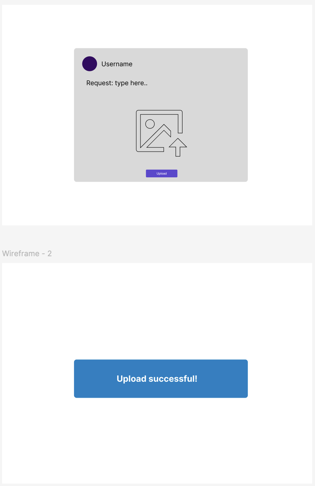
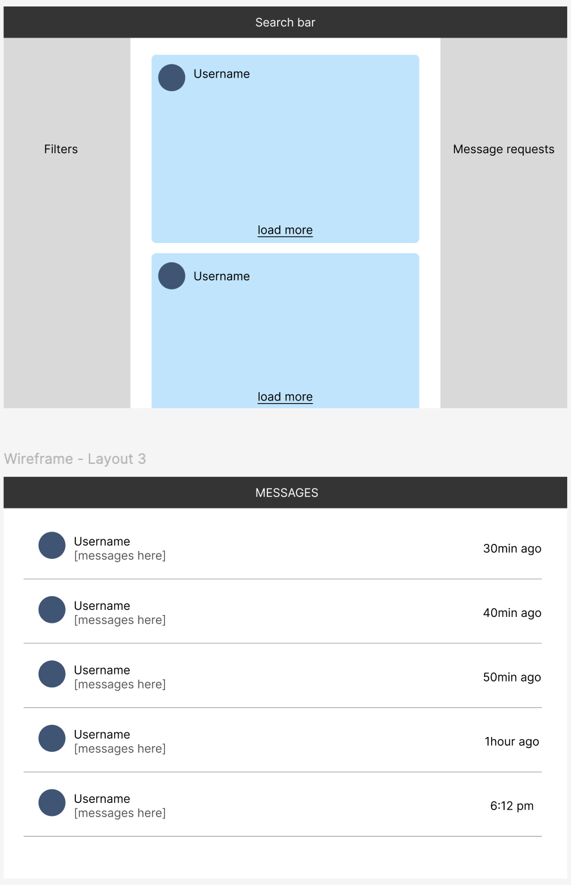
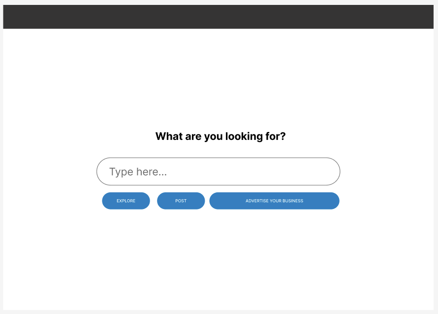
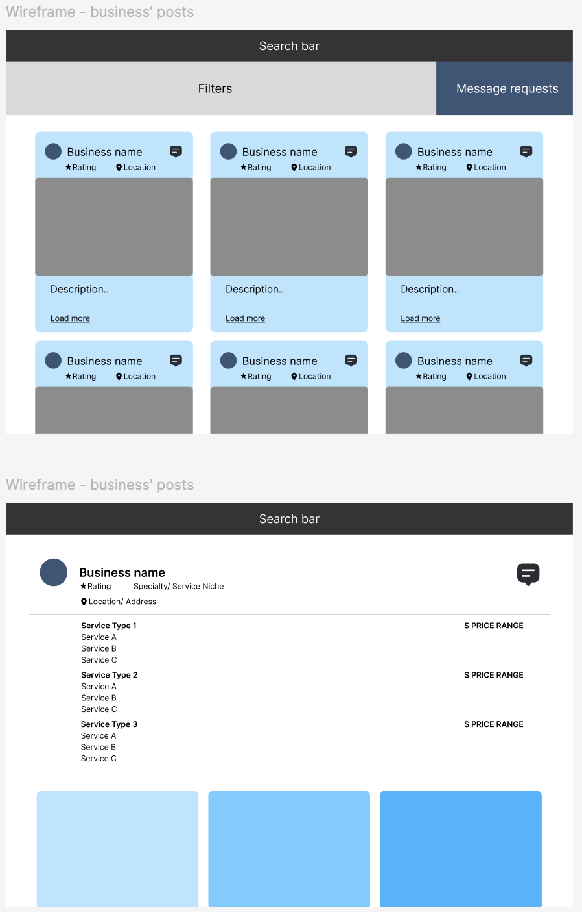
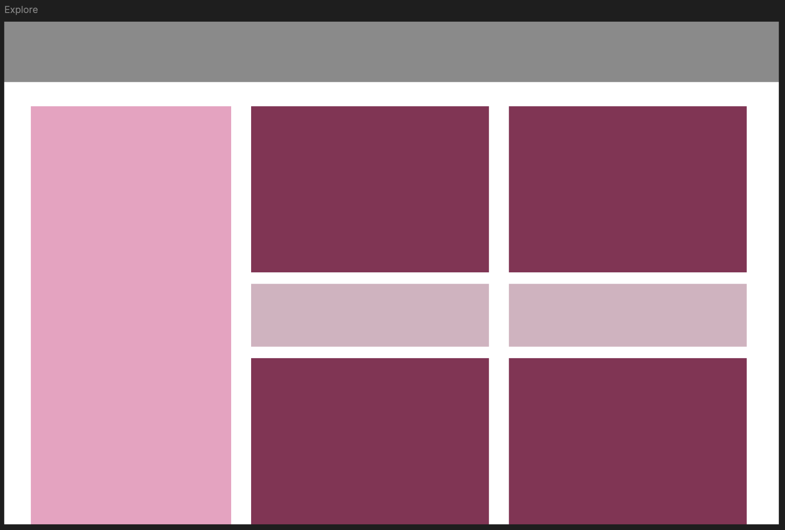
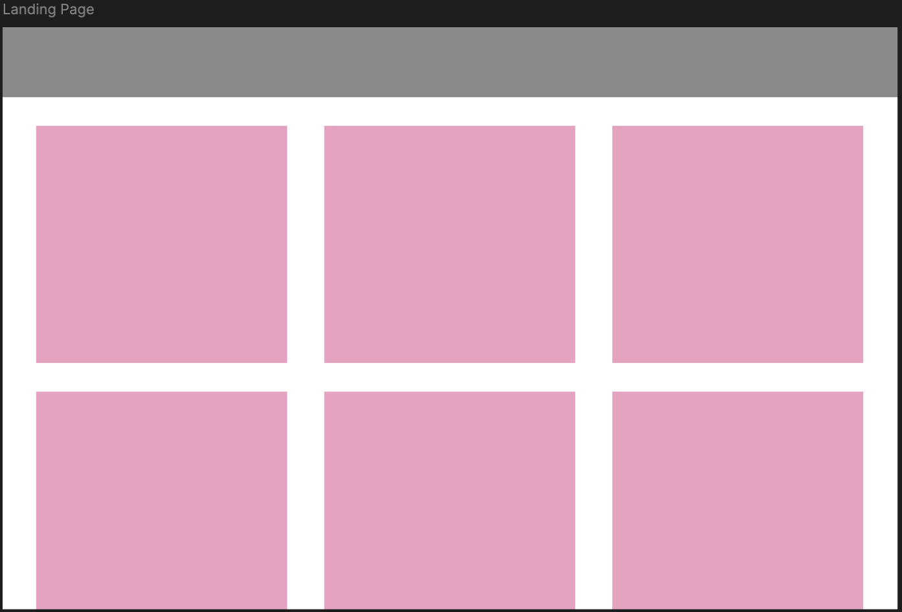

This week’s objective was to identify recurring trends, interaction patterns, and core components that could inform the foundational structure of the website. By analysing these elements early in the design process, we aimed to establish a modular system where components could be reused and adapted efficiently across different sections of the platform. This approach not only streamlines future design decisions, but also supports scalability, flexibility, and easier refinement as new features and user needs emerge.

Within the community hub, we identified two primary user groups: service providers and consumers. Since both groups interact with the community hub differently, this distinction became important in shaping the platform’s structure, navigation, and functionality. The following is a breakdown of how we envision the users to interact with the app:

**Service Provider:**
- Create a business profile
- Create posts advertising services and events
- Manage profile and update operating hours
- Respond to user enquiries or engagement on posts

**Consumer/User:**
- Search for services using filters including opening hours, location, category, keywords
- Create posts for requests
- View and compare posts from different service providers
- Communicate with service providers through comments or chat feature
- Leave reviews and provide feedback
- Save or pin useful providers 

After identifying the core components and user interactions, we translated these requirements into digital wireframes to visualise how the system would need to function in practice. Rather than focusing on visual layout alone, the wireframing process helped us evaluate whether the proposed features could support the needs of both service providers and consumers user flows. By rearranging and combining components, we were able to distinguish between essential and non-essential features and identified which could be treated as optional, which should be removed, and which were too complex to be included in the initial prototype. Essential features include search by filter, creating posts, and service discovery. 

  
Later Updates

After doing more work into planning the backend system of the website, we revisited our wireframes and improved the layout to suit the system. This change focuses more on feasibility and ensures that our design can be made within the given timeframe. Though this design decision simplifies what we originally envisioned, the deliverable adequately conveys our intentions.

After further planning of the backend system for ‘After Dark’, we revisited our wireframes to ensure the layout aligned with the underlying data requirements. We found that the existing design could be refined to better reflect the structure of the system and put more emphasis on the features being implemented in the prototype. However, this also raised the concern that some additional features were being compromised in order to prioritise feasibility and core functionality within the initial prototype scope. Ultimately, this trade-off was deemed necessary and the wireframes were redesigned.

## Wireframes

  
Initial Wireframes

